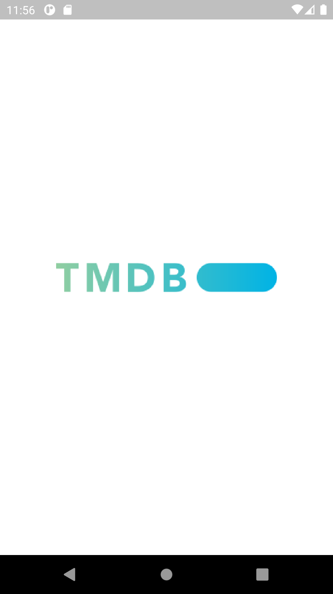
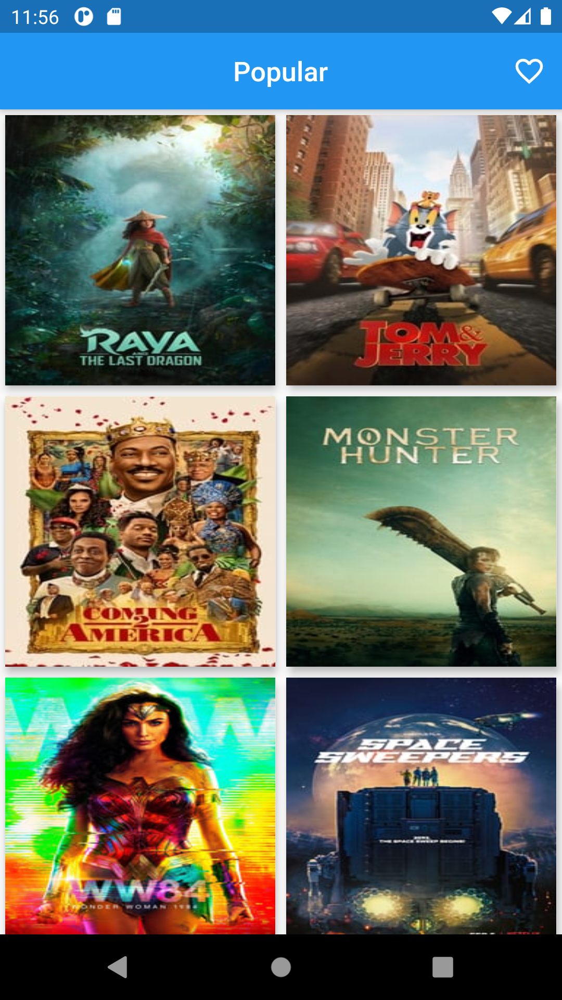
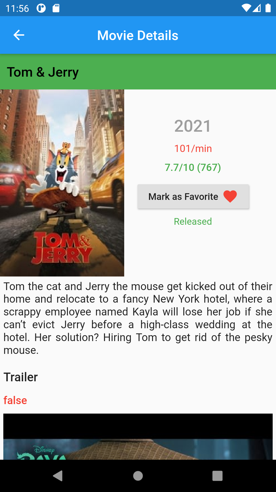
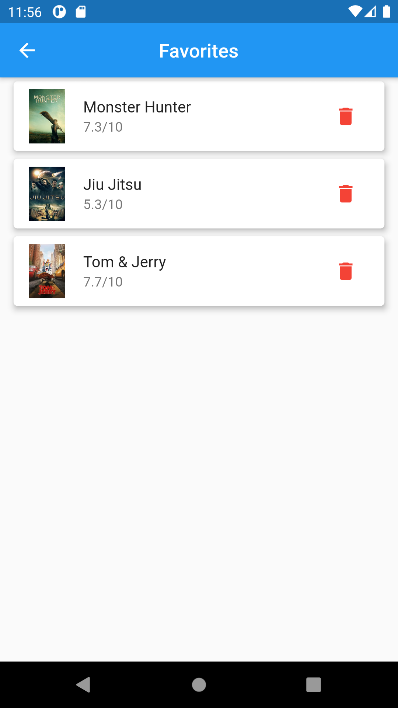
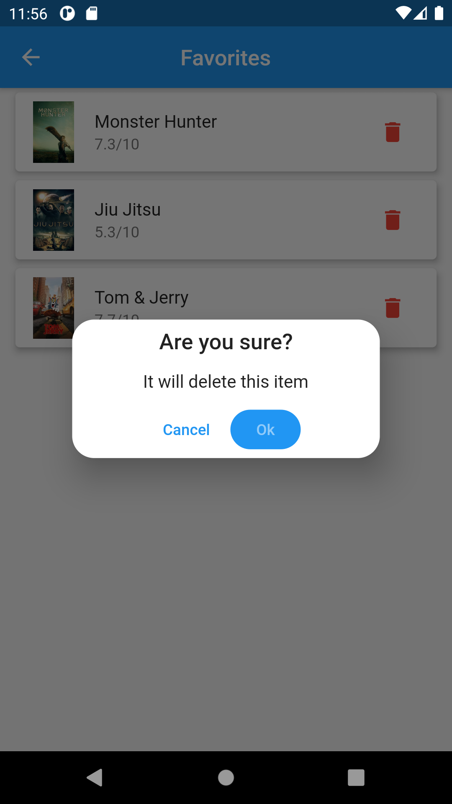

# movie_app

A new Flutter application.

## Getting Started
This project used MVC pattern, Getx for state managment, sqflite for backend database, url_launcher for opening youtube video.
Everything setup perfectly, if you wanna try this just go to https://www.themoviedb.org/ and make an account to get api key for yourself.
After that just go to lib> service> network_service and change the api key with your key. Then you're good to go. thanks and happy coding :)

## App UI

    

